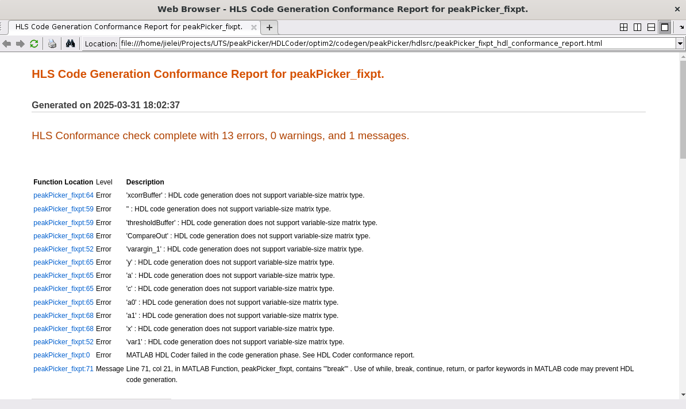

# Error occurs when running HDL coder

```matlab
function [locations]= peakPicker(xcorr,threshold,window_length)
% Copyright 2021-2023 The MathWorks, Inc.

    locations=[];
    middle_location=floor(window_length/2);
    xcorrBuffer = zeros(window_length, size(xcorr, 2)); % Preallocate buffer for current window
    thresholdBuffer = zeros(window_length, 1); % Preallocate buffer for threshold
    
    % writeptr=1;
    for index=1:length(xcorr)-window_length+1
        xcorrBuffer(2:end,:) = xcorrBuffer(1:end-1,:); % Shift buffer
        xcorrBuffer(1,:) = xcorr(index,:); % Add new sample to buffer
        thresholdBuffer(2:end) = thresholdBuffer(1:end-1); % Shift threshold buffer
        thresholdBuffer(1) = threshold(index); % Add new threshold to buffer
        if (index >= window_length)
            candidate_location = index - middle_location;
            % Hardware friendly implementation of peak finder
            MidSample = xcorrBuffer(middle_location+1,:);
            CompareOut = xcorrBuffer - MidSample; % this is a vector
            % if all values in the result are negative and the middle sample is
            % greater than a threshold, it is a local max
            if all(CompareOut <= 0) && (MidSample > thresholdBuffer(middle_location+1))
                locations = [locations candidate_location]; %#ok
            end
        end
        % writeptr=writeptr+1;
    end
end
```

Code generation failed:


View error report for detail info.


```log
Computed maximum size is not bounded.
HDL Code generation requires all dimensions to be fixed in size.
The computed size is [1 x :?].More Info
```

# Update MATLAB code

```matlab
function [locations]= peakPicker(xcorr,threshold,window_length)
% Copyright 2021-2023 The MathWorks, Inc.
    maxLocs = 16; % Maximum number of locations to store
    locations = zeros(maxLocs, 1); % Preallocate memory for locations
    numLocs = 0; % Initialize number of locations found
    % locations=[];
    middle_location=floor(window_length/2);
    xcorrBuffer = zeros(window_length, size(xcorr, 2)); % Preallocate buffer for current window
    thresholdBuffer = zeros(window_length, 1); % Preallocate buffer for threshold
    
    % writeptr=1;
    for index=1:length(xcorr)-window_length+1
        xcorrBuffer(2:end,:) = xcorrBuffer(1:end-1,:); % Shift buffer
        xcorrBuffer(1,:) = xcorr(index,:); % Add new sample to buffer
        thresholdBuffer(2:end) = thresholdBuffer(1:end-1); % Shift threshold buffer
        thresholdBuffer(1) = threshold(index); % Add new threshold to buffer
        if (index >= window_length)
            candidate_location = index - middle_location;
            % Hardware friendly implementation of peak finder
            MidSample = xcorrBuffer(middle_location+1,:);
            CompareOut = xcorrBuffer - MidSample; % this is a vector
            % if all values in the result are negative and the middle sample is
            % greater than a threshold, it is a local max
            if all(CompareOut <= 0) && (MidSample > thresholdBuffer(middle_location+1))
                numLocs = numLocs + 1; % Increment number of locations found
                if numLocs > maxLocs
                    break; % Stop if maximum number of locations is reached
                end
                locations(numLocs) = candidate_location; % Store the location
                % locations = [locations candidate_location]; %#ok
            end
        end
        % writeptr=writeptr+1;
    end
end
```

Code generation failed:


View error report for detail info.


```log
peakPicker_fixpt:64	Error	'xcorrBuffer' : HDL code generation does not support variable-size matrix type.
peakPicker_fixpt:59	Error	'' : HDL code generation does not support variable-size matrix type.
peakPicker_fixpt:59	Error	'thresholdBuffer' : HDL code generation does not support variable-size matrix type.
peakPicker_fixpt:68	Error	'CompareOut' : HDL code generation does not support variable-size matrix type.
```

# Update MATLAB code

```matlab
function [locations]= peakPicker(xcorr,threshold,window_length)
% Copyright 2021-2023 The MathWorks, Inc.
    maxLocs = 16; % Maximum number of locations to store
    locations = zeros(maxLocs, 1); % Preallocate memory for locations
    numLocs = 0; % Initialize number of locations found
    % locations=[];
    middle_location=floor(window_length/2);
    xcorrBuffer = zeros(11, 1);
    thresholdBuffer = zeros(11, 1);
    % xcorrBuffer = zeros(window_length, size(xcorr, 2)); % Preallocate buffer for current window
    % thresholdBuffer = zeros(window_length, 1); % Preallocate buffer for threshold
    
    % writeptr=1;
    for index=1:length(xcorr)-window_length+1
        xcorrBuffer(2:end,:) = xcorrBuffer(1:end-1,:); % Shift buffer
        xcorrBuffer(1,:) = xcorr(index,:); % Add new sample to buffer
        thresholdBuffer(2:end) = thresholdBuffer(1:end-1); % Shift threshold buffer
        thresholdBuffer(1) = threshold(index); % Add new threshold to buffer
        if (index >= window_length)
            candidate_location = index - middle_location;
            % Hardware friendly implementation of peak finder
            MidSample = xcorrBuffer(middle_location+1,:);
            CompareOut = xcorrBuffer - MidSample; % this is a vector
            % if all values in the result are negative and the middle sample is
            % greater than a threshold, it is a local max
            if all(CompareOut <= 0) && (MidSample > thresholdBuffer(middle_location+1))
                numLocs = numLocs + 1; % Increment number of locations found
                if numLocs > maxLocs
                    break; % Stop if maximum number of locations is reached
                end
                locations(numLocs) = candidate_location; % Store the location
                % locations = [locations candidate_location]; %#ok
            end
        end
        % writeptr=writeptr+1;
    end
end
```

Code generation failed:


View error report for detail info.


```log
peakPicker_fixpt:1	Error	IO pin count '168240' exceeds the IO Mapping Threshold '5000'. Redesign the model or use HDL optimizations to reduce IOs. To generate code without changing the design, change the "Check for DUT pin count exceeding I/O Threshold" diagnostic to "Warning" or "None". However, the generated code is not synthesizable.
peakPicker_fixpt:0	Error	Error: failed to run validation tasks: hdlcoder:matlabhdlcoder:bad_ir The MATLAB design contains constructs that are unsupported for HDL code generation.
peakPicker_fixpt:0	Error	MATLAB HDL Coder failed in the post code generation phase.
```

The SystemC code generated by HDL Coder

```C++
// -------------------------------------------------------------
//
// File Name: /home/jielei/Projects/UTS/peakPicker/HDLCoder/optim2/codegen/peakPicker/hdlsrc/peakPicker_fixpt_wrapper.cpp
// Created: 2025-03-31 18:19:00
//
// -- Generated by MATLAB 24.2, MATLAB Coder 24.2 and HDL Coder 24.2
// --
//
// -------------------------------------------------------------
#include "peakPicker_fixptClass.hpp"

peakPicker_fixptClass inst;
void peakPicker_fixpt_wrapper(ap_ufixed<14,-7> xcorr[6001], ap_ufixed<14,-7>
  threshold[6001], ap_uint<4> window_length, ap_uint<13> locations[16])
{
  inst.peakPicker_fixpt(xcorr, threshold, window_length, locations);
}
```

